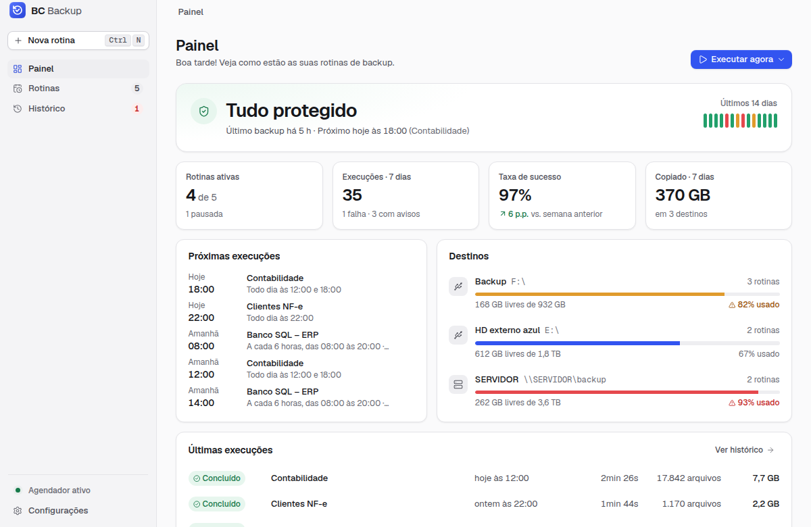
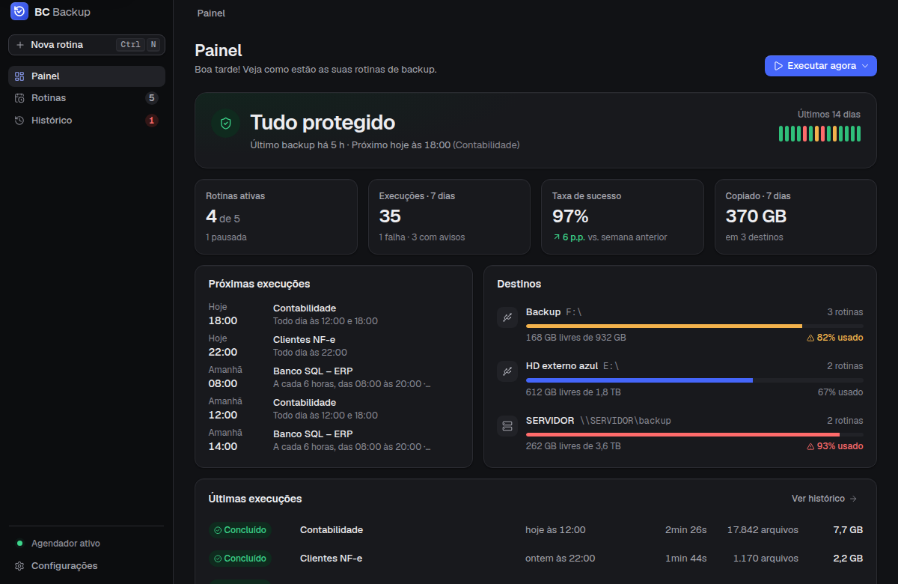
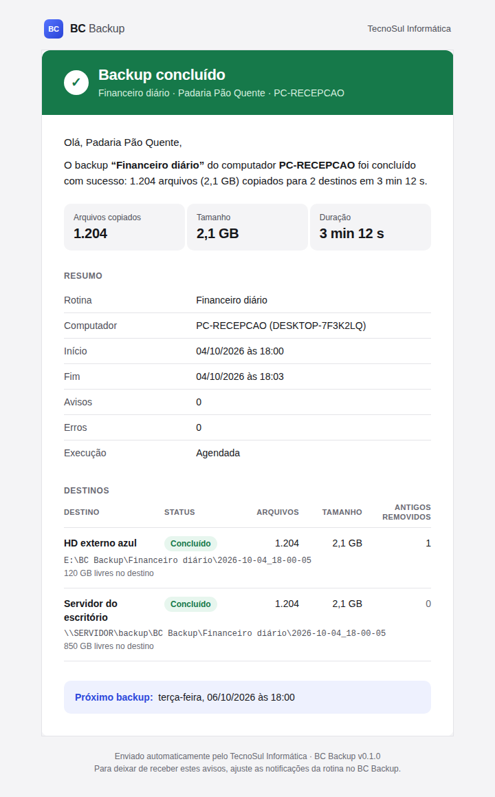
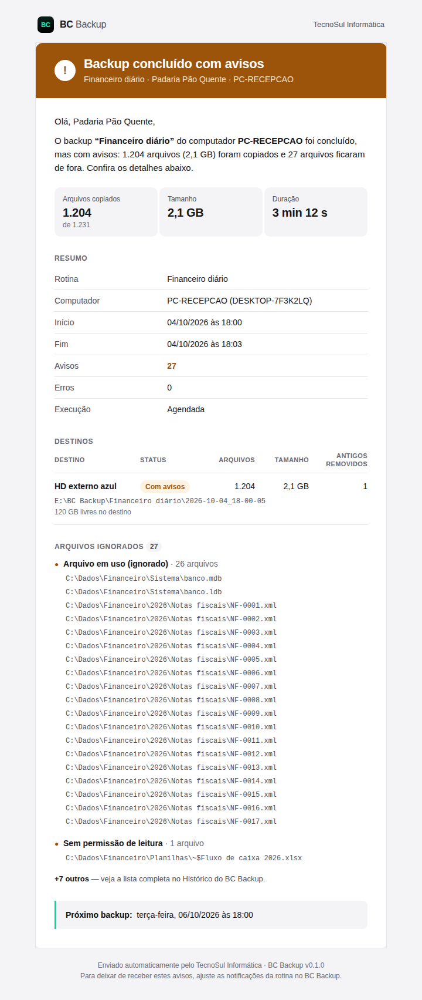
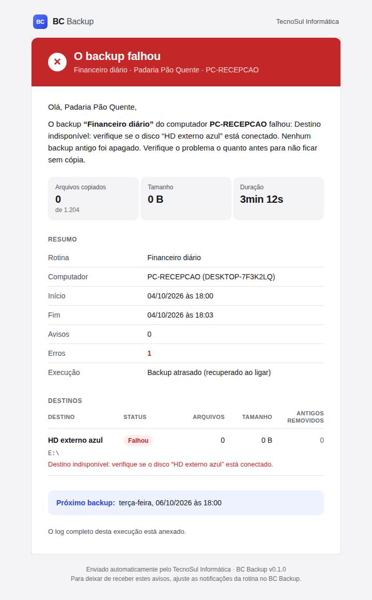
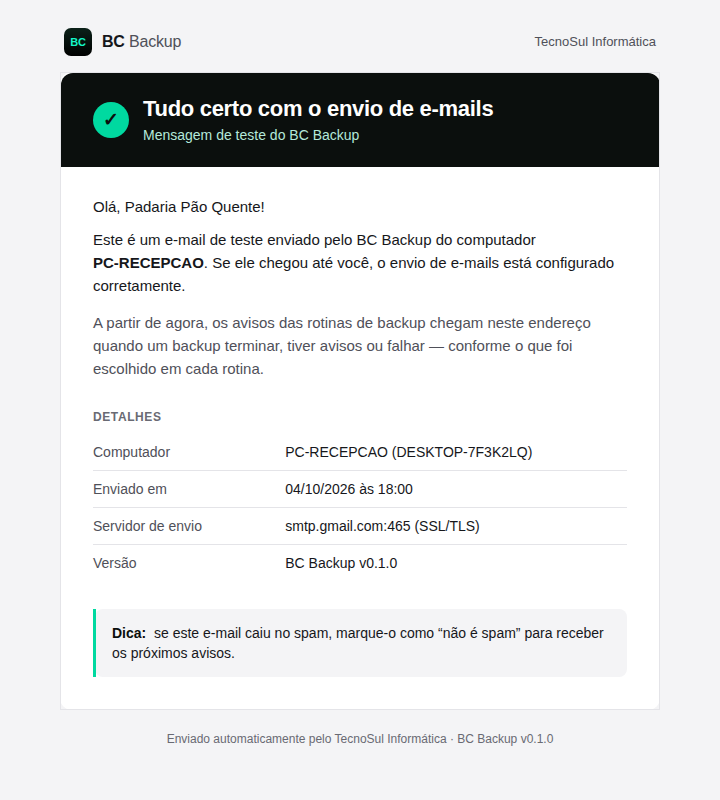

<p align="center">
  
</p>

<p align="center">
  <strong>Backups automáticos, simples de conferir e que avisam quando algo dá errado.</strong><br>
  Aplicativo desktop para Windows (também macOS e Linux) feito para o técnico de TI instalar nos computadores dos clientes.
</p>

---

O **BC Backup** copia as pastas e arquivos importantes de um computador para **um ou mais destinos** (HD externo,
pendrive, outra unidade, pasta de rede `\\servidor\backup`) nos dias e horários escolhidos. Cada execução gera uma
**pasta datada** comum — ou um **ZIP** — que qualquer pessoa abre no Explorer, sem formato proprietário. Os backups
antigos são apagados sozinhos depois de N dias (sempre sobrando um mínimo de cópias), e o cliente e o técnico
recebem **um e-mail claro** ao fim de cada backup. Falha nunca é silenciosa: ícone vermelho na bandeja, notificação
do Windows e e-mail.

## Funcionalidades

- **Rotinas** com nome próprio: criar, editar, duplicar, pausar/retomar e excluir.
- **Várias origens** (pastas e arquivos) e **vários destinos por rotina** — cada destino com status próprio.
- **Pasta datada** (`BC Backup\<Rotina>\2026-10-04_18-00-00\`) ou **ZIP** por execução.
- **Filtros** de inclusão/exclusão (com exclusões padrão: `Thumbs.db`, `~$*`, `*.tmp`, lixeira…).
- **Verificação da cópia**: rápida (tamanho + data) ou completa (relendo o destino).
- **Agendamento interno**: dias da semana e até 6 horários, a cada N horas (com janela), ao iniciar o computador ou
  manual. **Backup atrasado** (PC desligado no horário) roda uma vez ao ligar.
- **Retenção** por dias de calendário + **mínimo garantido** de backups ("manter 7 dias, nunca menos de 3").
- **E-mail** por SMTP (Gmail, Microsoft 365, Hostinger, Locaweb, UOL, KingHost, HostGator ou personalizado) com
  resumo, destinos, arquivos ignorados e próximo backup; botão **Enviar e-mail de teste**; log anexado opcional.
- **Bandeja do sistema**: roda em segundo plano, inicia com o Windows, mostra o estado (ok, em execução, erro).
- **Painel e histórico** com detalhes por destino, log completo e "Abrir pasta do backup".
- **Marca própria**: nome da empresa do técnico e do cliente nos e-mails.
- **Tema claro e escuro**, interface em português do Brasil.

## Telas

| Claro                                                                   | Escuro                                                                  |
| ----------------------------------------------------------------------- | ----------------------------------------------------------------------- |
|  |  |

E-mails enviados ao fim de cada backup (prévias em [`docs/email-preview/`](docs/email-preview/)):

| Concluído                                                     | Com avisos                                                    | Falhou                                                       | Teste de SMTP                                            |
| ------------------------------------------------------------- | ------------------------------------------------------------- | ------------------------------------------------------------ | -------------------------------------------------------- |
|  |  |  |  |

## Instalação (para quem vai usar)

Baixe o `BC-Backup-Setup-<versão>-x64.exe` na página de **Releases** do repositório (ou no artefato
`BC-Backup-Setup` da última execução do GitHub Actions) e siga o [manual](docs/MANUAL.md). A instalação é
**por usuário** (não pede administrador). Enquanto o instalador não tiver assinatura digital, o Windows SmartScreen
mostra um aviso na primeira vez: clique em **Mais informações → Executar assim mesmo**.

## Desenvolvimento

Requisitos: **Node.js 22.12+** (o CI usa o 24) e npm. No Linux, para abrir o Electron sem tela, `xvfb`.

```bash
npm install          # também baixa o Electron (postinstall)
npm run dev          # app Electron com recarga automática (electron-vite)
npm run dev:web      # só a interface no navegador, com dados simulados (http://localhost:5199)
npm run typecheck    # TypeScript (main/preload/testes e renderer)
npm run lint         # ESLint
npm test             # testes unitários (Vitest): agendador, retenção, cópia, ZIP, e-mail…
npm run e2e          # build + testes E2E com Playwright controlando o Electron
```

Na interface simulada (`npm run dev:web`) dá para forçar cenários pela URL: `?scenario=running|ok|warning|failed|empty`,
`?empty=1`, `?theme=light|dark`, `?platform=win32|darwin`, `?slow=1` (mostra os estados de carregamento).

No Linux sem interface gráfica (ou no CI), rode o E2E dentro do `xvfb`:

```bash
xvfb-run -a npm run e2e
```

Como root (containers), o Chromium do Electron só abre com `--no-sandbox`.

Outros comandos úteis:

```bash
node build/scripts/generate-icons.mjs   # regenera ícones do app, da bandeja e imagens do instalador
PREVIEW=1 npx vitest run test/mail-template.test.ts   # regenera docs/email-preview/*.html e *.png
```

> Os dois usam o Chromium do Playwright. Se ele não estiver instalado, aponte `CHROMIUM_PATH` para um Chromium
> existente (ex.: `CHROMIUM_PATH=/opt/pw-browsers/chromium`).

## Gerar o instalador do Windows

**Pelo CI (recomendado):** todo push na `main` e toda PR geram o instalador NSIS no `windows-latest`; baixe o
artefato **BC-Backup-Setup** na execução do workflow _build_. Para publicar uma versão:

```bash
npm version 0.2.0          # atualiza package.json e cria a tag v0.2.0
git push --follow-tags     # o workflow cria a Release e anexa o .exe
```

Tags com hífen (`v1.0.0-beta.1`) viram pré-lançamento.

**Localmente, no Windows:**

```bash
npm run dist:win           # → dist/BC-Backup-Setup-<versão>-x64.exe
```

Gerar o NSIS no Linux exige `wine`; por isso o instalador sai do Windows. Há também `npm run dist:mac` (DMG
universal, num Mac) e `npm run dist:linux` (AppImage e .deb). A configuração está em
[`electron-builder.yml`](electron-builder.yml): instalador assistido em português, por usuário, com atalhos na
Área de Trabalho e no Menu Iniciar (necessário para as notificações do Windows) e
[`build/installer.nsh`](build/installer.nsh), que remove o "Iniciar com o Windows" ao desinstalar.

## Estrutura do projeto

```
src/
  shared/      tipos de domínio, contrato IPC (window.bc), agendamento, formatação pt-BR, padrões
  main/        processo principal: janela, bandeja, inicialização com o sistema, agendador,
               motor de backup (cópia, ZIP, verificação, retenção), e-mail (SMTP + modelos), persistência
  preload/     ponte segura que expõe window.bc ao renderer
  renderer/    interface React + Tailwind CSS v4
test/          testes unitários (Vitest)
e2e/           testes ponta a ponta (Playwright + Electron)
build/         ícone do app (icon.svg/png/ico), imagens e script do instalador, gerador de ícones
resources/     arquivos usados em tempo de execução: ícones da bandeja, logo e wordmark
docs/
  MANUAL.md        manual do técnico e do cliente
  research/        pesquisas de produto, design system e arquitetura
  email-preview/   prévias dos e-mails
  screenshots/     telas do app
.github/workflows/ CI: testes, E2E e instalador do Windows
```

## Onde ficam os dados

Tudo fica na pasta de dados do usuário (`userData` do Electron):

| Sistema | Pasta                                     |
| ------- | ----------------------------------------- |
| Windows | `%APPDATA%\BC Backup`                     |
| macOS   | `~/Library/Application Support/BC Backup` |
| Linux   | `~/.config/BC Backup`                     |

Dentro dela: `config.json` (rotinas, configurações e a senha SMTP cifrada), `state.json` (estado do agendador), `history.ndjson` e
`runs/` (histórico e detalhes de cada execução) e `logs/bc-backup.log`. Os **backups** em si ficam nos destinos
escolhidos, em `BC Backup\<Rotina>\<data>\`, cada um com o manifesto `bcbackup-manifesto.json`. Desinstalar o
programa **não** apaga essa pasta nem os backups.

## Segurança

- **Senha do SMTP** cifrada com o `safeStorage` do Electron (DPAPI no Windows, Keychain no macOS,
  libsecret/kwallet no Linux). Ela nunca volta para a interface — o renderer só sabe se existe uma senha salva.
  No Linux sem chaveiro (backend `basic_text`) a senha fica apenas ofuscada — o app detecta esse caso.
- **Interface isolada**: `contextIsolation` + `sandbox`, sem `nodeIntegration`; o renderer só fala com o processo
  principal pelos métodos tipados de `window.bc`.
- **Fuses do Electron** no app empacotado: sem `ELECTRON_RUN_AS_NODE`, sem `NODE_OPTIONS`, cookies cifrados,
  verificação de integridade do `app.asar` e carregamento só a partir dele.
- **E-mails** sem imagens ou conteúdo remoto e com todo texto vindo do usuário ou do disco escapado (nomes de
  arquivo não injetam HTML); quebras de linha são removidas do assunto.
- A **retenção só apaga** pastas/ZIPs com manifesto válido da própria rotina — nunca arquivos do usuário.
